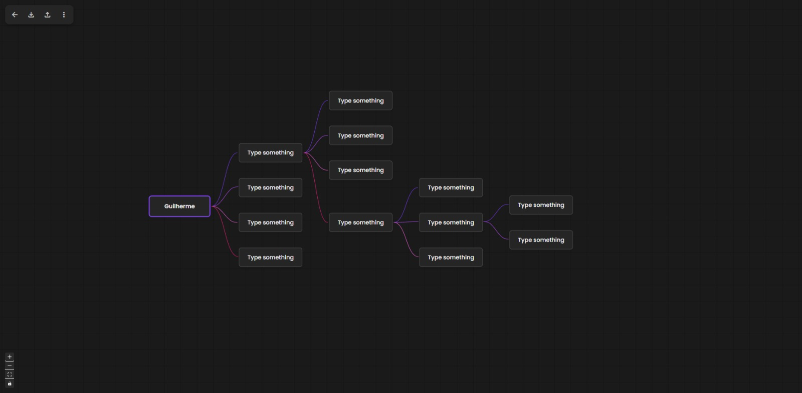

# MindMap

Uma aplicação web interativa para criação e gestão de mapas mentais, desenvolvida com uma arquitetura moderna de Frontend e um Backend leve. O projeto permite criar nós, estabelecer conexões e organizar ideias visualmente com recursos de layout automático.



## 🚀 Funcionalidades

- **Mapas Mentais Interativos:** Criação de nós e arestas com interface "drag-and-drop" utilizando [React Flow](https://reactflow.dev/).
- **Layout Automático:** Organização automática dos nós para melhor visualização (baseado em Dagre).
- **Gestão de Projetos:** Criação, salvamento e listagem de múltiplos projetos de mapas mentais.
- **Autenticação de Utilizadores:** Sistema de Login e Registo de utilizadores.
- **Temas:** Suporte a deteção de tema (Claro/Escuro).
- **Nós Interativos:** Capacidade de adicionar, editar e expandir nós diretamente na interface.

## 🛠️ Tecnologias Utilizadas

### Frontend

- **React 19** + **Vite** (Build tool e Framework)
- **TypeScript** (Tipagem estática)
- **React Flow (@xyflow/react)** (Biblioteca de grafos/mapas)
- **Zustand** (Gestão de estado)
- **TailwindCSS** (Estilização)
- **Lucide React** (Ícones)
- **Dagre** (Algoritmo de layout de grafos)

### Backend

- **PHP** (API RESTful simples)
- **SQLite** (Base de dados leve baseada em ficheiro)

## 📂 Estrutura do Projeto

```text
mind-map/
├── backend/            # API PHP e base de dados SQLite
│   ├── auth_middleware.php
│   ├── database.php
│   ├── login.php
│   ├── mindmap.sqlite  # Ficheiro da base de dados
│   └── ...
├── src/                # Código fonte Frontend (React)
│   ├── components/     # Componentes reutilizáveis (Nós, Modais, Paineis)
│   ├── hooks/          # Custom Hooks (Layout, Cores, Eventos)
│   ├── pages/          # Páginas da aplicação (Login, Projetos, MindMap)
│   ├── utils/          # Utilitários e chamadas à API
│   └── ...
├── index.html
├── package.json
└── vite.config.ts
```

## ⚙️ Pré-requisitos

- **Node.js** (versão 18 ou superior)
- **Gestor de pacotes:** pnpm (recomendado devido à presença do `pnpm-lock.yaml`), npm ou yarn.
- **Servidor PHP:** Necessário para rodar a pasta `/backend` (ex: Apache, Nginx, ou o servidor embutido do PHP).
- **Extensão SQLite:** Habilitada no PHP (`php.ini`).

## 🚀 Instalação e Execução

### 1. Configurar o Backend

A aplicação requer que o backend PHP esteja a correr para funcionar a autenticação e o salvamento de dados.

1. Navegue até à pasta backend:

```bash
cd backend
```

2. Garanta que o ficheiro da base de dados e a pasta têm permissões de escrita.
3. Pode iniciar um servidor PHP embutido para testes (na porta 8000, por exemplo):

```bash
php -S localhost:8000
```

_Nota: Poderá ser necessário ajustar a URL da API no frontend (`src/utils/api.ts`) caso a porta seja diferente._

### 2. Configurar o Frontend

1. Instale as dependências:

```bash
pnpm install
# ou
npm install
```

2. Inicie o servidor de desenvolvimento:

```bash
pnpm dev
# ou
npm run dev
```

3. Aceda à aplicação no navegador (geralmente em `http://localhost:5173`).

## 📜 Scripts Disponíveis

- `npm run dev`: Inicia o servidor de desenvolvimento Vite.
- `npm run build`: Compila o TypeScript e gera a build de produção.
- `npm run lint`: Executa o ESLint para verificar a qualidade do código.
- `npm run preview`: Visualiza a build de produção localmente.

## 🔒 Base de Dados

O projeto utiliza **SQLite**. O ficheiro da base de dados encontra-se em `backend/mindmap.sqlite`.
O script `backend/database.php` gere a conexão e a criação automática das tabelas (`users`, `projects`, etc.) caso não existam.

---

Desenvolvido com ❤️ utilizando React e PHP.
