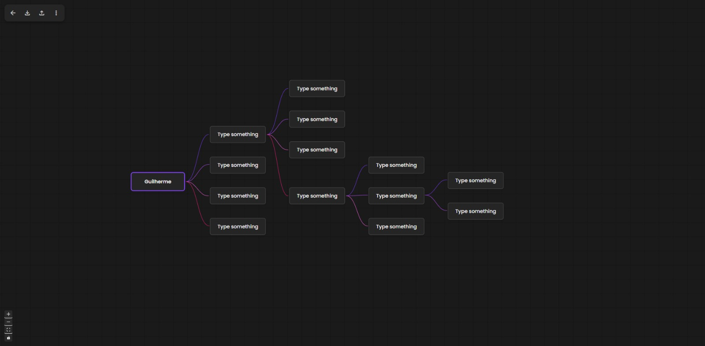

# MindMap

Interactive mind map editor — portfolio project with local browser storage, no backend required.

**Live demo:** [guilhermeroesler.github.io/MindMap](https://guilhermeroesler.github.io/MindMap/) · **Source:** [github.com/GuilhermeRoesler/MindMap](https://github.com/GuilhermeRoesler/MindMap)



---

## English

### Highlights

- Interactive mind maps with [React Flow](https://reactflow.dev/) — drag, connect, and edit nodes inline
- Auto layout powered by Dagre
- Full project dashboard with create, rename, open, delete, export, and import
- Pre-loaded **Demo Mind Map** on first visit
- Local storage persistence — no login, no server
- Light / dark / system theme toggle
- Keyboard shortcuts dock and first-visit onboarding (does not cover the map)
- Auto-save with cinematic status pill in the editor
- Export framed PNG for portfolio screenshots
- Deployed on GitHub Pages with CI/CD

### Tech stack

React 19 · Vite · TypeScript · React Flow · TailwindCSS · Dagre · Vitest

### Quick start

```bash
npm install
npm run dev
```

Open `http://localhost:5173`.

### Keyboard shortcuts (editor)

| Key         | Action                  |
| ----------- | ----------------------- |
| `Tab`       | Create child node       |
| `Enter`     | Create sibling node     |
| `Delete`    | Remove selected node    |
| `+` buttons | Add nodes on left/right |

### Deploy

Push to `main` triggers `.github/workflows/deploy.yml`. Enable **GitHub Actions** as the Pages source in repository settings.

---

## Português

### Destaques

- Mapas mentais interativos com [React Flow](https://reactflow.dev/)
- Layout automático com Dagre
- Dashboard com CRUD completo + export/import de backup JSON
- Projeto **Demo Mind Map** criado automaticamente na primeira visita
- Persistência em `localStorage` — sem login, sem backend
- Tema claro / escuro / sistema
- Painel de atalhos em dock + onboarding discreto na primeira visita
- Auto-save com indicador visual no editor
- Export PNG enquadrado para screenshots de portfólio
- Deploy automático no GitHub Pages

### Instalação

```bash
npm install
npm run dev
```

Acesse `http://localhost:5173`.

### Atalhos (editor)

| Tecla    | Ação                   |
| -------- | ---------------------- |
| `Tab`    | Criar nó filho         |
| `Enter`  | Criar nó irmão         |
| `Delete` | Remover nó selecionado |

### Scripts

| Script             | Descrição                                |
| ------------------ | ---------------------------------------- |
| `npm run dev`      | Servidor de desenvolvimento              |
| `npm run build`    | Build de produção                        |
| `npm run test`     | Testes unitários                         |
| `npm run validate` | typecheck + lint + format + test + build |

### Persistência

Projetos ficam em `localStorage` (chave `mindmap_projects`). Use **Export backup** / **Import backup** no dashboard para transferir dados entre browsers.

---

Developed with React and React Flow.
